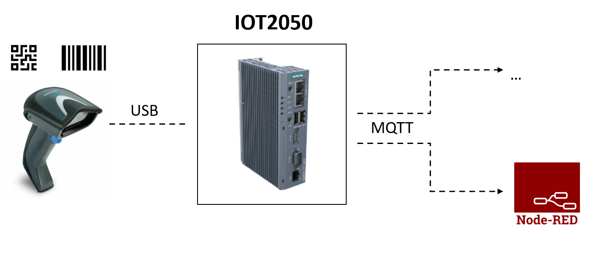
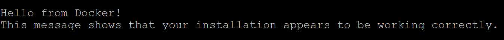

# **QR-Scanner-Application**

This IOT2050 application has the task of.... [overview text]

## **Hardware**

The following hardware components are required for the application:

- **SIMATIC IOT2050**
- **Datalogic Scanning Inc. GD4430-BK Scanner**

It is possible to use another scanner, but then some adjustments have to be made in the main-file (this will be explained later).

## **Prepare the IOT2050**

Follow [SIMATIC_IOT2050_Setting_up.md](https://github.com/uwedaeumler/IOT2050-SmartFarming-Application/blob/main/docs/SIMATIC_IOT2050_setting_up.md) for the following steps:

- Installing the SD-Card Example Image (in this example the image V1.1.1 was used)
- First commissioning of the SIMATIC IOT2050: Remote access with Putty SSH Connection
- Working internet connection on the IOT2050

An update must be performed for the system and *git* must be installed. The following commands are executed for this:

    sudo apt-get update
    sudo apt-get upgrade
    sudo apt-get install git

## **Install Docker on the IOT2050**

**Set up the repository:**

    sudo apt-get update

    sudo apt-get install \ ca-certificates \ curl \ gnupg \ lsb-release

    curl -fsSL https://download.docker.com/linux/debian/gpg | sudo gpg --dearmor -o /usr/share/keyrings/docker-archive-keyring.gpg

**Install Docker Engine:**

    sudo apt-get update

    sudo apt-get install docker-ce docker-ce-cli containerd.io

**Verify the successful installation:**

    sudo docker run hello-world

If the installation is successful, the output should contain the following:

**Add Docker-Compose:**

    sudo curl -L --fail https://github.com/AppTower/docker-compose/releases/download/latest/run.sh -o /usr/local/bin/docker-compose

    sudo chmod +x /usr/local/bin/docker-compose

## **Clone the application from Github**

To clone the latest version of LoRa Basics™ Station from Github use the following commands:

    cd /home
    git clone https://github.com/......   [Link einfügen]
