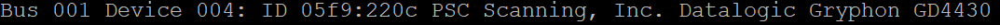
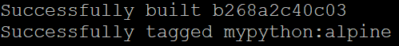
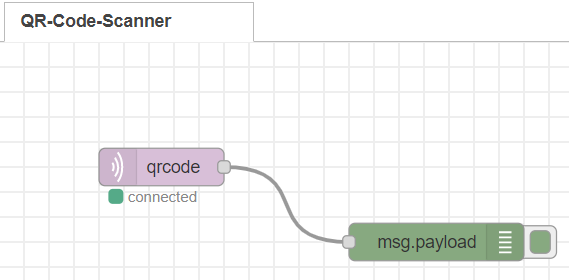
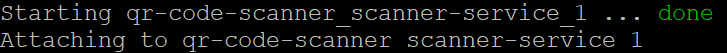
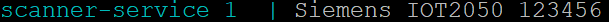
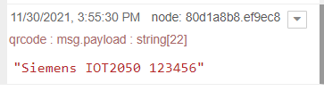

# **QR-Scanner-Application**

This IOT2050 application has the task of.... [overview text]

## **Hardware**

The following hardware components are required for the application:

- **SIMATIC IOT2050**
- **Datalogic Scanning Inc. GD4430-BK Scanner**

## **Prepare the IOT2050**

Follow [SIMATIC_IOT2050_Setting_up.md](https://github.com/SIMATICmeetsLinux/IOT2050-SmartFarming-Application/blob/main/docs/SIMATIC_IOT2050_setting_up.md) for the following steps:

- Installing the SD-Card Example Image (in this example the image V1.1.1 was used)
- First commissioning of the SIMATIC IOT2050: Remote access with Putty SSH Connection
- Working internet connection on the IOT2050

In addition, the barcode scanner must now be connected to the IOT2050 via USB. The following command can be used to check whether the scanner is connected:

    lsusb

An update must be performed for the system and *git* must be installed. The following commands are executed for this:

    sudo apt-get update
    sudo apt-get upgrade
    sudo apt-get install git

## **Install Docker on the IOT2050**

**Set up the repository:**

    sudo apt-get update

    sudo apt-get install \ ca-certificates \ curl \ gnupg \ lsb-release

    curl -fsSL https://download.docker.com/linux/debian/gpg | sudo gpg --dearmor -o /usr/share/keyrings/docker-archive-keyring.gpg

**Install Docker Engine:**

    sudo apt-get update

    sudo apt-get install docker-ce docker-ce-cli containerd.io

**Verify the successful installation:**

    sudo docker run hello-world

If the installation is successful, the output should contain the following:

**Add Docker-Compose:**

    sudo curl -L --fail https://github.com/AppTower/docker-compose/releases/download/latest/run.sh -o /usr/local/bin/docker-compose

    sudo chmod +x /usr/local/bin/docker-compose

## **Clone the application from Github**

To clone the latest version of LoRa Basics™ Station from Github use the following commands:

    cd /home
    git clone https://github.com/uwedaeumler/qr-code-scanner  [Link einfügen]

The repository with the application files can now be opened by the following command:

    cd qr-code-scanner/src/

## **Build Docker-File**

The following command in the application-repository can be used to build the docker-file:

    docker-compose build

## **Optional: Import Node-Red Flow**

On the Example Image version 1.1.1 (used in this manual) Node-Red is already preinstalled and autostart is enabled. To access it, open a browser on your PC connected to the IOT2050 and open the URL `http://<IP of the IOT2050>:1880/`.

Download the ready-made JSON-FIle: [qr-code-flow.json](qr-code-flow.json)

Import the flow and press the "deploy-button":

    Menu -> Import -> Select a file to import -> Press the Import-Button

If all configurations are set correctly, the flow will look like the following.

## **Start the QR-Code-Application**

To start the docker-application go to the application-directory (qr-code-scanner/src/) and use the following command:

    docker-compose up

The application is ready when it is successfully launched:

Barcodes and QR-Codes can now be scanned using the scanner. These are then displayed in the terminal and transferred to Node-Red via the mqtt node.

The following examples can be used for testing:

